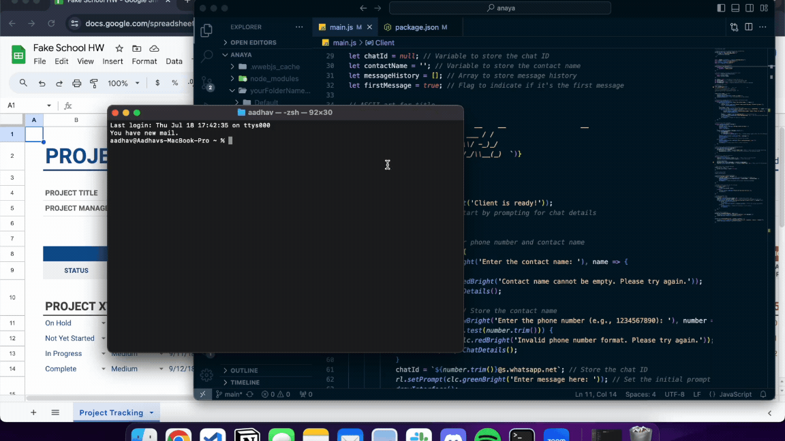

# Anaya (CLI Whatsapp Client)

<div align="center">
  
  <p align="center"><br>
<i>Demo of Anaya</i></p>
</div>
<br>


Anaya is a command-line application to interact with WhatsApp via Terminal. This tool allows you to discreetly send and receive WhatsApp messages directly from your terminal.

I built this because I wanted to respond to my girlfriend's texts during work or class, discreetly. If I took out my phone or opened up WhatsApp on my laptop, I could get in trouble. I noticed that non-technical people's eyes just glaze over when you use a terminal, so this is a way for me to text her during 9-5 hours without anyone peering over my shoulder. Maybe it's helpful for you.

## Features

- Send and receive WhatsApp messages
- Interactive command-line interface
- QR code scanning for authentication

## Prerequisites

Before you begin, ensure you have met the following requirements:

- You have installed Node.js and npm.
- You have a WhatsApp account.

## Installation

### From GitHub

#### Clone the repository

   ```sh
   git clone https://github.com/aadhavr/cli-whatsapp-client.git
   cd cli-whatsapp-client
   ```

#### Install dependencies

   ```sh
   npm install
   ```

#### Install globally (optional)

   If you want to use the `anaya` command from anywhere in your terminal, you can install the package globally:

   ```sh
   npm install -g
   ```

### Via npm

If the package is published on npm, you can install it directly from npm:

#### Install globally

   ```sh
   npm install -g msg-anaya
   ```

## Usage

To use the Anaya CLI tool, follow these steps:

#### Run the CLI tool

   If you installed the package globally, simply run:

   ```sh
   anaya
   ```

   If you did not install it globally, you can run it using Node.js:

   ```sh
   node main.js
   ```

#### Follow the prompts

- Enter the contact name.
- Enter the phone number of the contact. 
- **Make sure to include the international number prefix**
  - i.e: 91 if it's an Indian number
- Enter your message and send.

#### *Example Session*

   ```
   $ anaya

     _      __    __                   __
    | | /| / /__ / /______  __ _  ___ / /
    | |/ |/ / -_) / __/ _ \/  ' \/ -_)_/ 
    |__/|__/\__/_/\__/\___/_/_/_/\__(_)  
 
    You: Hi Anaya!
    Anaya: Hey!
    You: What's up?
    Anaya: Just doing homework. You?


    > Procrastinating...
   ```


## Contributing

Contributions are always welcome! Here’s how you can help:

1. Fork the repository.
2. Create a new branch (`git checkout -b feature-foo`).
3. Make your changes and commit them (`git commit -m 'Add some foo'`).
4. Push to the branch (`git push origin feature-foo`).
5. Open a pull request.

Please make sure to update tests as appropriate.

## Contact

If you want to contact me, you can reach me at [aadhav.rajesh@gmail.com](mailto:aadhav.rajesh@gmail.com).

## Acknowledgments

- [whatsapp-web.js](https://github.com/pedroslopez/whatsapp-web.js)
- [qrcode-terminal](https://github.com/gtanner/qrcode-terminal)
- [cli-color](https://github.com/medikoo/cli-color)
